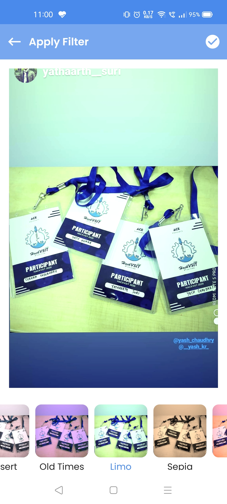
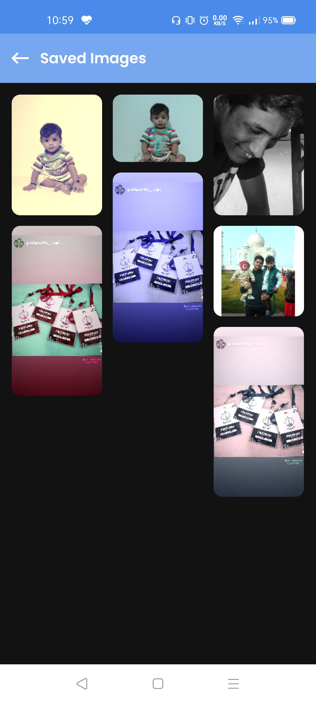
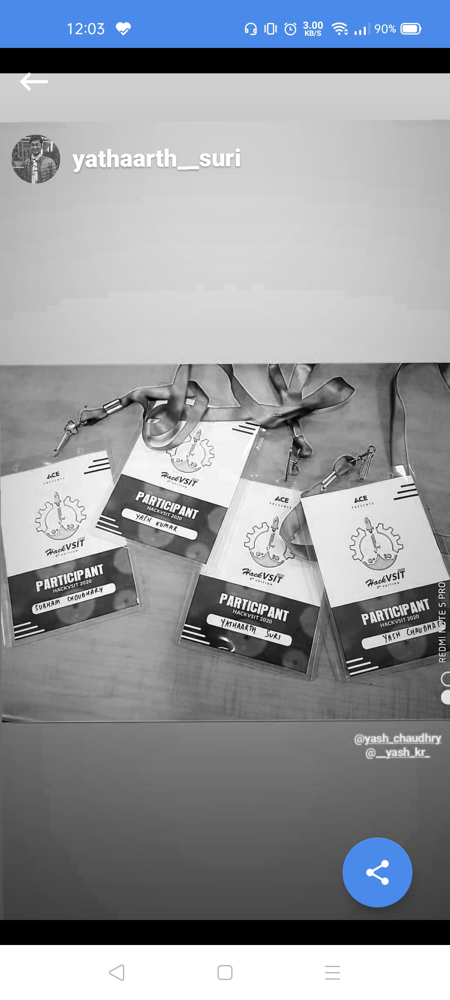

# Description 

- Application Name - **Photo Editor**
- Architecture Used - MVVM
- Language Used - Kotlin (v1.4.32)  
- IDE used - Android Studio (v4.1.2)  

# Screenshots

 | Editing Screen | Saved Images | Share Image |
 --------------|------------|-------------|
 |  |   |  |

# Dependencies

- [ViewModel](https://developer.android.com/jetpack/androidx/releases/lifecycle)
- [Retrofit](https://square.github.io/retrofit/)
- [Scalable Size Unit](https://github.com/intuit/sdp)
- [GPU](https://github.com/cats-oss/android-gpuimage)
- [Rounded Image View](https://github.com/vinc3m1/RoundedImageView)
